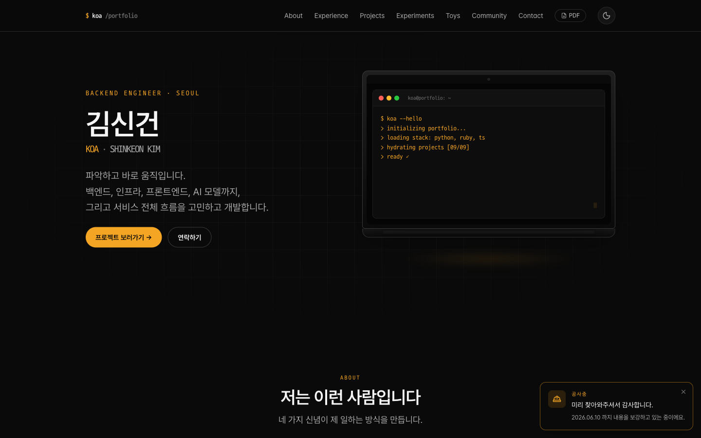
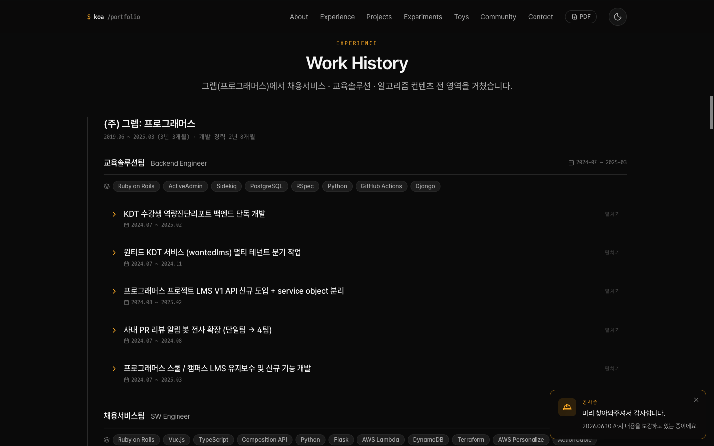
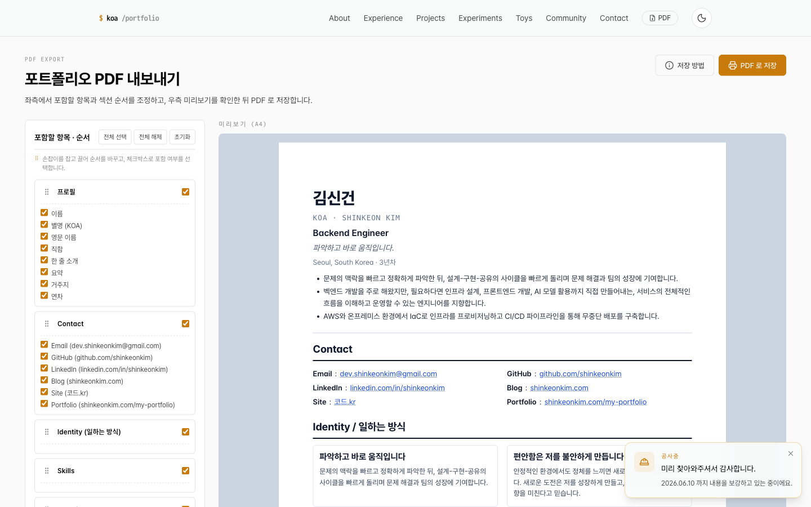

<div align="center">

# `$ koa /portfolio`

**김신건 / Backend Engineer** 의 개인 포트폴리오 사이트

Backend 를 중심으로 인프라 · 프론트엔드 · AI 모델까지, 서비스 전체 흐름을 고민하는 엔지니어의 이력 · 프로젝트 · 활동을 한 페이지에 정리합니다.

[](https://shinkeonkim.com/my-portfolio/)
[](https://vuejs.org/)
[](https://www.typescriptlang.org/)
[](https://vitejs.dev/)
[](https://tailwindcss.com/)
[](https://pages.github.com/)

</div>

<br />



---

## ✨ 소개

- **단일 페이지 포트폴리오** — About · Experience · Projects · Experiments · Toys · Community · Contact 까지 하나의 페이지에서 흘러갑니다.
- **데이터 중심 설계** — 콘텐츠는 모두 `src/data/*.ts` 의 타입 안전한 객체로 분리되어 있어, 사이트 코드를 거의 건드리지 않고 이력 · 프로젝트 · 활동을 갱신할 수 있습니다.
- **이력서 PDF 즉시 생성** — 필요한 섹션만 골라 드래그로 순서를 바꾸고 한 장의 A4 이력서로 인쇄/저장할 수 있습니다.
- **다크 / 라이트 모드** — 시스템 설정을 따르고, 우상단 토글로 즉시 전환됩니다.

<br />

## 🚀 Live

|               | URL                                                                      |
| ------------- | ------------------------------------------------------------------------ |
| 메인          | [`shinkeonkim.com/my-portfolio/`](https://shinkeonkim.com/my-portfolio/) |
| 프로젝트 상세 | `/projects/:slug` (예: `/projects/mefit`)                                |
| PDF 내보내기  | [`/my-portfolio/pdf`](https://shinkeonkim.com/my-portfolio/pdf)          |

<br />

## 📸 Screenshots

<table>
  <tr>
    <td align="center">
      <strong>Work History</strong><br />
      펼침/접힘으로 한눈에 흐름과 세부 작업을 함께 표현합니다.
    </td>
    <td align="center">
      <strong>PDF Export</strong><br />
      섹션 선택 + 드래그 순서 변경 → A4 미리보기 + <kbd>Cmd</kbd>+<kbd>P</kbd> 저장.
    </td>
  </tr>
  <tr>
    <td></td>
    <td></td>
  </tr>
</table>

<br />

## 🧱 사이트 구성

| 섹션                   | 컴포넌트                                                                       | 데이터                                                                     |
| ---------------------- | ------------------------------------------------------------------------------ | -------------------------------------------------------------------------- |
| Hero                   | [`HeroLaptop.vue`](src/components/sections/HeroLaptop.vue)                     | [`profile.ts`](src/data/profile.ts), [`identity.ts`](src/data/identity.ts) |
| About / Identity       | [`IdentitySection.vue`](src/components/sections/IdentitySection.vue)           | [`identity.ts`](src/data/identity.ts)                                      |
| Skills                 | [`SkillsSection.vue`](src/components/sections/SkillsSection.vue)               | [`skills.ts`](src/data/skills.ts)                                          |
| Experience             | [`ExperienceSection.vue`](src/components/sections/ExperienceSection.vue)       | [`experience.ts`](src/data/experience.ts)                                  |
| Projects               | [`ProjectsSection.vue`](src/components/sections/ProjectsSection.vue)           | [`projects/`](src/data/projects/)                                          |
| AI Experiments         | [`AIExperimentsSection.vue`](src/components/sections/AIExperimentsSection.vue) | [`ai-experiments.ts`](src/data/ai-experiments.ts)                          |
| Toy Projects           | [`ToyProjectsSection.vue`](src/components/sections/ToyProjectsSection.vue)     | [`toy-projects/`](src/data/toy-projects/)                                  |
| Community / Activities | [`ActivitiesSection.vue`](src/components/sections/ActivitiesSection.vue)       | [`activities.ts`](src/data/activities.ts)                                  |
| Awards                 | [`AwardsSection.vue`](src/components/sections/AwardsSection.vue)               | [`awards.ts`](src/data/awards.ts)                                          |
| Contact                | [`ContactSection.vue`](src/components/sections/ContactSection.vue)             | [`contact.ts`](src/data/contact.ts)                                        |

<br />

## 🗺️ Routing

| Path              | View                                                   | 역할                                                        |
| ----------------- | ------------------------------------------------------ | ----------------------------------------------------------- |
| `/`               | [`HomeView`](src/views/HomeView.vue)                   | 모든 섹션을 순서대로 노출                                   |
| `/projects`       | [`ProjectsView`](src/views/ProjectsView.vue)           | 프로젝트 목록                                               |
| `/projects/:slug` | [`ProjectDetailView`](src/views/ProjectDetailView.vue) | 프로젝트 상세 (Feature · Challenges · Media · GitHub Stats) |
| `/pdf`            | [`PdfExportView`](src/views/PdfExportView.vue)         | 섹션 선택 + 드래그 정렬 + A4 미리보기                       |
| `*`               | [`NotFoundView`](src/views/NotFoundView.vue)           | 404                                                         |

<br />

## 🛠️ Tech Stack

| 영역                | 사용 기술                                                     |
| ------------------- | ------------------------------------------------------------- |
| **Framework**       | Vue 3.5 + `<script setup>` + TypeScript 5.9                   |
| **Build**           | Vite 8 + `vue-tsc`                                            |
| **Style**           | Tailwind CSS 4.3 + CSS 변수 기반 디자인 토큰 (다크/라이트)    |
| **Routing / State** | Vue Router 5.1 + Pinia 3                                      |
| **Animation**       | GSAP 3.15 (ScrollTrigger) + Lenis 1.3 (smooth scroll)         |
| **Icons**           | lucide-vue-next                                               |
| **UX**              | `<dialog>` 기반 모달, vue-draggable-plus, `@unhead/vue` (SEO) |
| **Lint / Format**   | ESLint (flat config) + Prettier                               |
| **Test**            | Vitest                                                        |
| **CI / CD**         | GitHub Actions → GitHub Pages                                 |

<br />

## 🧭 주요 기능

- **이미지 라이트박스** ([`ImageLightbox.vue`](src/components/common/ImageLightbox.vue)) — 경력 / 프로젝트의 첨부 이미지를 클릭하면 키보드(`←` `→` `Esc` `F`) 단축키 + 화면 맞춤/원본 보기 토글로 확대.
- **프레젠테이션 슬라이드 뷰어** ([`PresentationSlideViewer.vue`](src/components/common/PresentationSlideViewer.vue)) — 프로젝트 발표 자료(예: mefit 캡스톤 26페이지)를 슬라이드 형태로 탐색.
- **Project Challenge Modal** ([`ProjectChallengeModal.vue`](src/components/common/ProjectChallengeModal.vue)) — 각 프로젝트의 _문제 → 옵션 비교 → 결정 → 구현 → 배운 점_ 을 카드 → 모달로 깊이 있게 펼침.
- **GitHub Stats Card** ([`GitHubStatsCard.vue`](src/components/common/GitHubStatsCard.vue)) — 프로젝트 저장소의 커밋 · 언어 · 기여자 통계 시각화.
- **PDF Export Pipeline** ([`pdf/`](src/components/pdf/)) — 도메인별 15개 PDF 블록 + 드래그 정렬 + 인쇄 친화 CSS (`@page A4`, `break-inside: avoid`).

<br />

## 📂 Project Structure

```text
my-portfolio/
├── public/                 # 정적 자원 (이미지, PDF, docs)
├── docs/screenshots/       # README 용 스크린샷
├── src/
│   ├── assets/             # 전역 CSS · 폰트 · 디자인 토큰
│   ├── components/
│   │   ├── common/         # 재사용 컴포넌트 (Card · Tag · Lightbox · Modal …)
│   │   ├── sections/       # 홈 페이지 섹션 컴포넌트
│   │   └── pdf/            # PDF 문서 · 선택 패널 · 도메인 블록
│   ├── composables/        # 컴포저블 (스무스 스크롤 등)
│   ├── data/               # 타입 안전한 콘텐츠 데이터
│   │   ├── projects/       # 프로젝트별 상세
│   │   └── toy-projects/   # 토이 프로젝트 카테고리별
│   ├── router/             # 라우팅 정의
│   ├── stores/             # Pinia 스토어 (PDF 선택 상태 등)
│   ├── types/              # 도메인 타입
│   └── views/              # 페이지 뷰
└── vite.config.ts          # base: '/my-portfolio/' (GitHub Pages)
```

<br />

## 🏁 Getting Started

[Bun](https://bun.com/) 또는 [Node 22+](https://nodejs.org/) + npm 환경에서 동작합니다.

```bash
# 1. 의존성 설치
bun install     # 또는 npm install

# 2. 개발 서버 (Vite, http://localhost:5173/my-portfolio/)
bun run dev     # 또는 npm run dev

# 3. 프로덕션 빌드
bun run build

# 4. 빌드 결과 미리보기
bun run preview
```

#### 코드 품질

```bash
bun run type-check    # vue-tsc --noEmit
bun run lint:check    # ESLint (CI 통과 조건)
bun run format        # Prettier 자동 정리
bun run test          # Vitest
```

<br />

## 🚢 Deployment

`main` 브랜치에 푸시하면 [`.github/workflows/deploy.yml`](.github/workflows/deploy.yml) 워크플로가 다음을 자동 수행합니다.

1. Bun 설치 + `bun install --frozen-lockfile`
2. `bun run lint:check` → `bun run test` → `bun run build`
3. `dist/404.html` 생성 (SPA fallback)
4. GitHub Pages 로 배포

별도 도메인이나 base path 가 다른 환경에 배포하려면 [`vite.config.ts`](vite.config.ts) 의 `base` 옵션을 조정하세요.

<br />

## 📝 콘텐츠 갱신 가이드

대부분의 갱신은 `src/data/*.ts` 만 손대면 됩니다.

| 갱신하고 싶은 것        | 수정 위치                                                                                           |
| ----------------------- | --------------------------------------------------------------------------------------------------- |
| 인적사항 / 한 줄 소개   | [`profile.ts`](src/data/profile.ts)                                                                 |
| 일하는 방식 (Identity)  | [`identity.ts`](src/data/identity.ts)                                                               |
| 기술 스택               | [`skills.ts`](src/data/skills.ts)                                                                   |
| 경력 / 회사 / 작업 상세 | [`experience.ts`](src/data/experience.ts)                                                           |
| 프로젝트 추가           | [`projects/<slug>.ts`](src/data/projects/) + [`projects/index.ts`](src/data/projects/index.ts) 등록 |
| 토이 프로젝트           | [`toy-projects/`](src/data/toy-projects/) 카테고리별                                                |
| AI 실험                 | [`ai-experiments.ts`](src/data/ai-experiments.ts)                                                   |
| 활동 / 커뮤니티         | [`activities.ts`](src/data/activities.ts)                                                           |
| 수상 · 자격증           | [`awards.ts`](src/data/awards.ts)                                                                   |
| 연락처                  | [`contact.ts`](src/data/contact.ts)                                                                 |

타입은 [`src/types/`](src/types/) 에 정의되어 있어 IDE 가 형식을 잡아줍니다.

<br />

## 📬 Contact

- **Email** — dev.shinkeonkim@gmail.com
- **GitHub** — [@shinkeonkim](https://github.com/shinkeonkim)
- **LinkedIn** — [linkedin.com/in/shinkeonkim](https://www.linkedin.com/in/shinkeonkim/)
- **Blog** — [shinkeonkim.com](https://shinkeonkim.com)

<br />

<div align="center">

Made with 🧡 in Seoul

</div>
